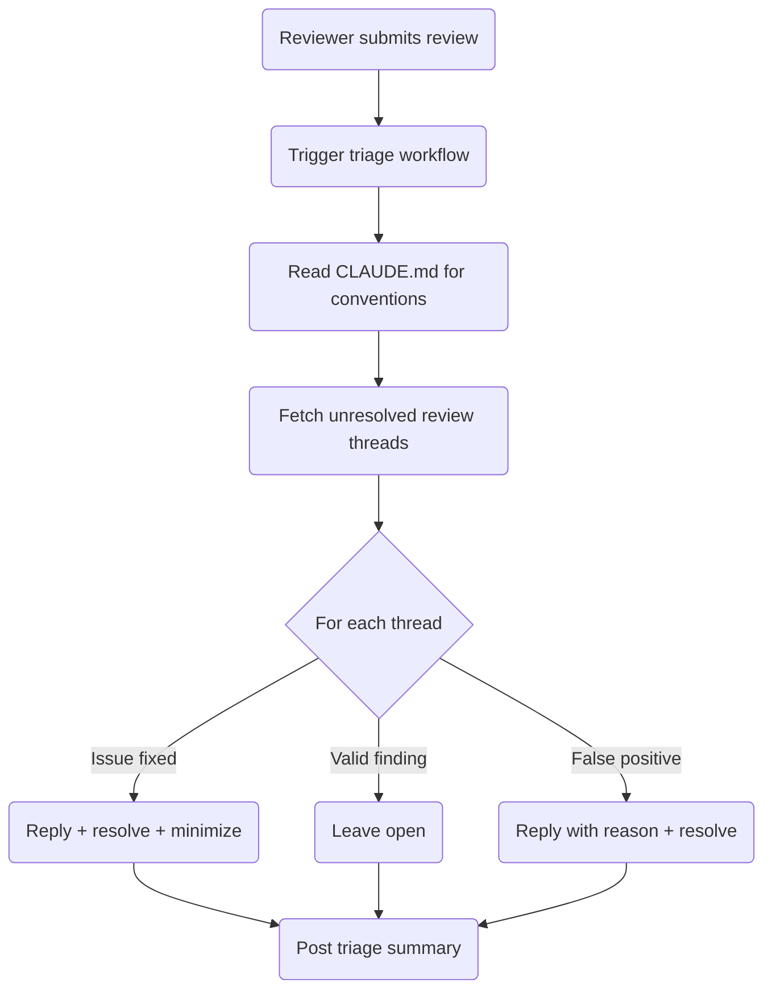

# Claude Code Review Triage Workflow

Automatically triage AI reviewer findings (Copilot, Greptile, etc.) using Claude. Runs as a separate workflow triggered when a reviewer submits its review.

## Architecture

```
Reviewer submits review → pull_request_review event → claude-code-review-triage.yml
  └─ uses: reusable-claude-code-review-triage.yml
       └─ Claude triages each finding
```

This is intentionally separate from the [Claude Code Review](claude-code-review.md) workflow. Splitting avoids timing issues (reviewers may finish after Claude) and keeps each prompt focused.

## Trigger

The workflow triggers on `pull_request_review` with type `submitted`. The reusable workflow filters by reviewer — currently `copilot-pull-request-reviewer[bot]`.

## Triage Process



### Classification

| Classification | Action |
|---------------|--------|
| **Fixed** | Reply explaining it's fixed, resolve thread, minimize as outdated |
| **Valid** | Leave thread open for human review |
| **False positive** | Reply with explanation, resolve thread |

Claude critically evaluates each finding — cosmetic nitpicks and style preferences are dismissed, only real bugs and meaningful improvements are acknowledged.

### Summary Comment

After triaging, a summary comment is posted on the PR:

```
## Claude Code Review Triage
Triaged **N** comment(s): **X** resolved, **Y** dismissed, **Z** acknowledged.
<details><summary>Details</summary>

| File | Finding | Action |
|------|---------|--------|
| `path/file` | One-line summary | Resolved / Dismissed / Acknowledged |

</details>
```

No comment is posted if there are no unresolved threads.

## Permissions

The caller workflow must grant:

| Permission | Level | Purpose |
|------------|-------|---------|
| `contents` | read | Read repository files |
| `pull-requests` | write | Reply to and resolve review threads |
| `issues` | write | Required for `gh pr comment` |
| `id-token` | write | OIDC authentication |

## Usage

```yaml
name: Claude Code Review Triage
on:
  pull_request_review:
    types: [submitted]
permissions: {}
jobs:
  triage:
    uses: SchweizerischeBundesbahnen/github-workflows-polarion/.github/workflows/reusable-claude-code-review-triage.yml@main
    permissions:
      contents: read
      pull-requests: write
      issues: write
      id-token: write
    secrets:
      CLAUDE_CODE_OAUTH_TOKEN: ${{ secrets.CLAUDE_CODE_OAUTH_TOKEN }}
```

## Configuration

- **Reusable workflow**: `reusable-claude-code-review-triage.yml`
- **Project rules**: `CLAUDE.md` in the calling repository
- **Secret required**: `CLAUDE_CODE_OAUTH_TOKEN`
- **Timeout**: 10 minutes
- **Max turns**: 15

## Related

- [Claude Code Review](claude-code-review.md) — the main code review workflow
