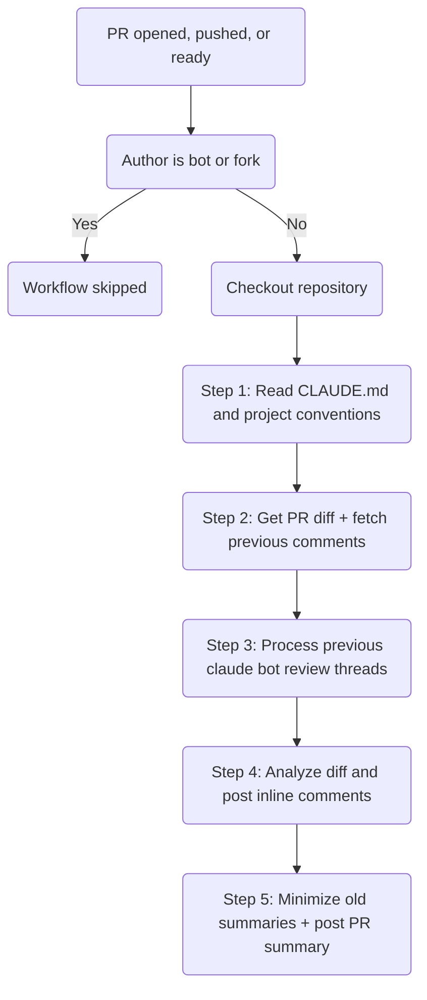
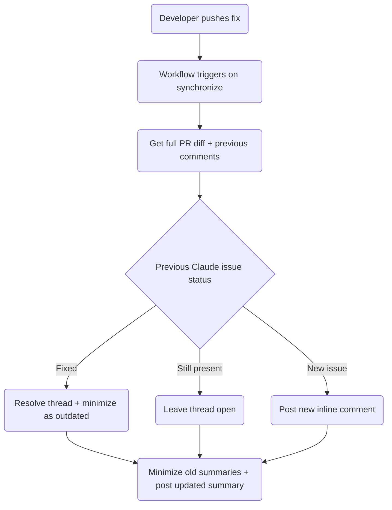

# Claude Code Review Workflow

Automated code review using [Claude Code Action](https://github.com/anthropics/claude-code-action) on pull requests, implemented as a reusable workflow.

## Architecture

This repository provides a **reusable workflow** (`reusable-claude-code-review.yml`) that any repository in the organization can call. This repo also uses it internally via a thin caller workflow (`claude-code-review.yml`).

```
calling-repo/.github/workflows/claude-code-review.yml
  └─ uses: SchweizerischeBundesbahnen/github-workflows-polarion/.github/workflows/reusable-claude-code-review.yml@main
```

## Trigger Conditions

The caller workflow triggers on pull request events:

| Event | Description |
|-------|-------------|
| `opened` | New PR created |
| `synchronize` | New commits pushed to an existing PR |
| `ready_for_review` | Draft PR marked as ready |
| `reopened` | Previously closed PR reopened |

### Skip Conditions

The review is **skipped** for:

- Bot PRs (username contains `[bot]`)
- PRs from forked repositories

### Concurrency

Only one review runs per PR at a time. If a new push arrives while a review is in progress, the running review is cancelled and a new one starts.

## Review Process



### Step 1: Learn Project Context

Claude reads `CLAUDE.md` and referenced files to understand code conventions, architecture decisions, and review standards.

### Step 2: Gather Review Context

- **Full PR diff** — reviews the complete diff (not just the last commit)
- **Previous review comments** — fetches prior comments and review threads from `claude[bot]` to avoid duplicates

### Step 3: Process Previous Review Threads

For every unresolved review thread authored by `claude[bot]`:

| Classification | Action |
|---------------|--------|
| **Fixed** | Resolve the thread and minimize the comment as outdated |
| **Still present** | Leave thread open, count in summary |
| **Already resolved** | Skip |

### Step 4: Analyze and Post Inline Comments

Claude reviews each changed line, focusing on:

| Category | Examples |
|----------|----------|
| Bugs / logic errors | Use-before-assignment, off-by-one, unreachable code |
| Security vulnerabilities | SQL injection, XSS, auth bypass, secrets exposure |
| Breaking changes | Signature changes, removed public API, not mentioned in PR |
| CLAUDE.md violations | Convention violations (cite the specific rule) |
| Missing error handling | Unhandled exceptions in new code paths |
| Missing tests | New functionality without corresponding tests |
| Performance issues | N+1 queries, unnecessary allocations in hot paths |

**Confidence threshold**: Each potential issue is scored 0-100. Only issues scoring **>= 80** are reported to minimize false positives.

**Ignored**: Unchanged code, style/formatting, optional improvements, external dependency versions.

Each inline comment follows this format:

```
<severity emoji> Concise one-sentence summary. Fix: specific solution.

<details>
<summary>Extended reasoning...</summary>

## What the bug is
...detailed explanation...

## Step-by-step proof
1. ...

## Impact
...

## How to fix
...code example...
</details>
```

**Severity levels:**

| Emoji | Severity | Description |
|-------|----------|-------------|
| :red_circle: | Bug | Will break at runtime |
| :orange_circle: | Security | Security vulnerability |
| :yellow_circle: | Warning | Likely bug or risky pattern |
| :large_blue_circle: | Convention | CLAUDE.md violation |

### Step 5: Minimize Old Summaries and Post PR Summary

Claude minimizes all previous summary comments as outdated, then posts a new summary:

| Scenario | Heading |
|----------|---------|
| Claude found issues | `## Claude Code Review Summary` |
| No issues found | `## ✅ No issues found` |

Each summary includes:

- Confidence score (1-5)
- Table of important files changed

**Confidence scale:**

| Score | Meaning |
|-------|---------|
| 5/5 | Simple, clear changes — fully understood |
| 4/5 | Well-structured changes — high confidence |
| 3/5 | Complex changes — some areas need human judgment |
| 2/5 | Very complex or unfamiliar domain |
| 1/5 | Unable to meaningfully assess |

## Re-review Behavior

When a developer pushes fixes after a review:



## Permissions

The caller workflow must grant these permissions:

| Permission | Level | Purpose |
|------------|-------|---------|
| `contents` | read | Read repository files |
| `pull-requests` | write | Post review comments |
| `issues` | write | Required for `gh pr comment` |
| `id-token` | write | OIDC authentication |

Claude's tool access is restricted to:

- `Read`, `Grep`, `Glob`, `BatchTool` — codebase exploration (read-only)
- `Bash(gh pr comment:*)` — post PR summary comments
- `Bash(gh pr diff:*)` — read PR diff
- `Bash(gh pr view:*)` — read PR metadata
- `Bash(gh api:*)` — submit inline review comments and manage threads

No write access to the repository. No ability to run builds, tests, or modify files.

## Usage

```yaml
name: Claude Code Review
on:
  pull_request:
    types: [opened, synchronize, ready_for_review, reopened]
concurrency:
  group: claude-review-${{ github.event.pull_request.number }}
  cancel-in-progress: true
permissions: {}
jobs:
  claude-review:
    uses: SchweizerischeBundesbahnen/github-workflows-polarion/.github/workflows/reusable-claude-code-review.yml@main
    permissions:
      contents: read
      pull-requests: write
      issues: write
      id-token: write
    secrets:
      CLAUDE_CODE_OAUTH_TOKEN: ${{ secrets.CLAUDE_CODE_OAUTH_TOKEN }}
```

## Related

- [Copilot Review Triage](claude-code-review-triage.md) — separate workflow that triages Copilot findings after its review

## Configuration

- **Reusable workflow**: `reusable-claude-code-review.yml`
- **Project rules**: `CLAUDE.md` in the calling repository
- **Secret required**: `CLAUDE_CODE_OAUTH_TOKEN`
- **Timeout**: 30 minutes
- **Max turns**: 30
