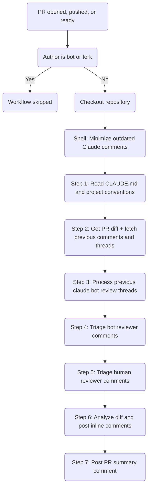
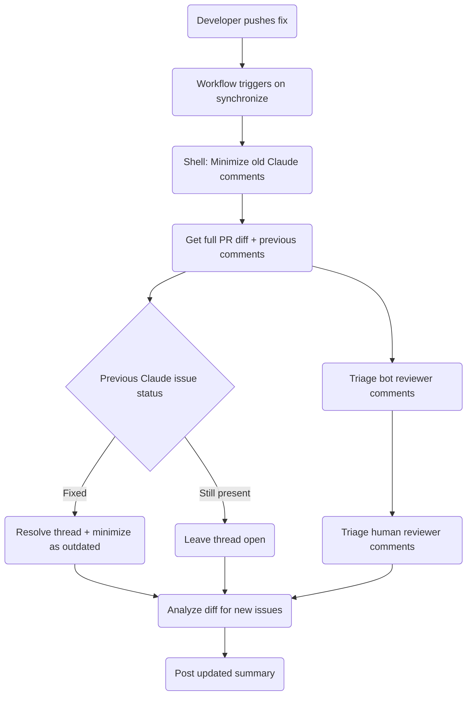

# Claude Code Review Workflow

Automated code review using [Claude Code Action](https://github.com/anthropics/claude-code-action) on pull requests, implemented as a reusable workflow.

## Architecture

This repository provides a **reusable workflow** (`reusable-claude-code-review.yml`) that any repository in the organization can call. This repo also uses it internally via a thin caller workflow (`claude-code-review.yml`).

```
calling-repo/.github/workflows/claude-code-review.yml
  └─ uses: SchweizerischeBundesbahnen/github-workflows-polarion/.github/workflows/reusable-claude-code-review.yml@main
```

## Trigger Conditions

The caller workflow triggers on pull request events:

| Event | Description |
|-------|-------------|
| `opened` | New PR created |
| `synchronize` | New commits pushed to an existing PR |
| `ready_for_review` | Draft PR marked as ready |
| `reopened` | Previously closed PR reopened |

### Skip Conditions

The review is **skipped** for:

- Bot PRs (username contains `[bot]`)
- PRs from forked repositories

### Concurrency

Only one review runs per PR at a time. If a new push arrives while a review is in progress, the running review is cancelled and a new one starts.

## Review Process

The steps are ordered so that all housekeeping (minimization, thread processing, triage) runs before the "find issues" analysis phase. This prevents Claude from short-circuiting when it finds no new issues.



### Pre-step: Minimize Outdated Comments (shell)

A dedicated shell step (not part of the Claude prompt) runs **before** the review. It finds all previous PR comments authored by `claude[bot]` that match summary or tracking patterns and minimizes them as outdated. This is a shell script, not a Claude instruction, so it always runs regardless of what Claude decides to do.

### Step 1: Learn Project Context

Claude reads `CLAUDE.md` and referenced files to understand code conventions, architecture decisions, and review standards.

### Step 2: Gather Review Context

- **Full PR diff** — reviews the complete diff (not just the last commit)
- **Previous review comments** — fetches prior comments and review threads (Claude, bot reviewers like Copilot/Greptile, and human reviewers) via REST API and GraphQL to avoid duplicates and enable thread processing. **Note:** GraphQL returns Bot app logins without the `[bot]` suffix (e.g. `claude` not `claude[bot]`), so `__typename` (`Bot` vs `User`) is used to distinguish bots from humans

### Step 3: Process Previous Review Threads

For every unresolved review thread authored by Claude (`__typename: Bot`, login: `claude`), Claude reads the **current file content** (not just the diff) to determine if the issue still exists:

| Classification | Action |
|---------------|--------|
| **Fixed** | Resolve the thread and minimize the comment as outdated |
| **Still present** | Leave thread open, count in summary |
| **Already resolved** | Skip |

### Step 4: Triage Bot Reviewer Comments (Copilot, Greptile, etc.)

Claude triages comments from all bot reviewers. For Copilot specifically, it first checks if the check run exists and polls every 30 seconds (up to 5 minutes) if still running. Then it finds all unresolved review threads where the author `__typename` is `Bot` (excluding Claude's own login), covering Copilot, Greptile, and any future bot reviewer.

For each unresolved bot reviewer thread, Claude reads the **current file content** and classifies:

| Classification | Action |
|---------------|--------|
| **Fixed** | Reply explaining it's fixed, resolve and minimize as outdated |
| **Valid** | Leave thread open, count in summary |
| **False positive** | Reply with explanation of why, resolve the thread |

Claude critically evaluates each finding — cosmetic nitpicks and style preferences are dismissed, only real bugs and meaningful improvements are acknowledged.

### Step 5: Triage Human Reviewer Comments

Claude triages comments from human reviewers (`__typename: User`, excluding the PR author). Only comments from other human reviewers are processed.

For each unresolved human reviewer thread, Claude reads the **current file content** and classifies:

| Classification | Action |
|---------------|--------|
| **Fixed** | Reply acknowledging the fix, resolve the thread |
| **Valid** | Acknowledge the comment, leave thread open for the PR author to address |
| **Already resolved** | Skip |

Key differences from bot triage:

- Human comments are **never dismissed** as false positives or cosmetic nitpicks — they are treated as high-signal feedback
- Valid human comments are **not resolved** by Claude — only humans should resolve human feedback
- Fixed comments are resolved with a respectful acknowledgment rather than a terse "Fixed" reply

### Step 6: Analyze and Post Inline Comments

Claude reviews each changed line using `mcp__github_inline_comment__create_inline_comment` (built-in MCP tool, no Docker required), focusing on:

| Category | Examples |
|----------|----------|
| Bugs / logic errors | Use-before-assignment, off-by-one, unreachable code |
| Security vulnerabilities | SQL injection, XSS, auth bypass, secrets exposure |
| Breaking changes | Signature changes, removed public API, not mentioned in PR |
| CLAUDE.md violations | Convention violations (must cite the specific rule) |
| Missing error handling | Unhandled exceptions in new code paths |
| Missing tests | New functionality without corresponding tests |
| Performance issues | N+1 queries, unnecessary allocations in hot paths |

**Confidence threshold**: Each potential issue is scored 0-100. Only issues scoring **>= 80** are reported to minimize false positives.

**Ignored**: Unchanged code, style/formatting, optional improvements, external dependency versions.

Each inline comment follows this format:

```
<severity emoji> Concise one-sentence summary. Fix: specific solution.

<details>
<summary>Extended reasoning...</summary>

Detailed explanation of the issue, proof, impact, and fix.
</details>
```

**Severity levels:**

| Emoji | Severity | Description |
|-------|----------|-------------|
| :red_circle: | Bug | Will break at runtime |
| :orange_circle: | Security | Security vulnerability |
| :yellow_circle: | Warning | Likely bug or risky pattern |
| :large_blue_circle: | Convention | CLAUDE.md violation |

### Step 7: Post PR Summary Comment

A summary comment is posted on the PR. The heading varies based on findings:

| Scenario | Heading |
|----------|---------|
| Claude found issues | `## Claude Code Review Summary` |
| No issues, no open bot/human reviewer findings | `## ✅ No issues found` |
| No Claude issues, but valid bot/human reviewer findings left open | `## ℹ️ No new issues found — N bot reviewer finding(s) and M human reviewer finding(s) acknowledged` |

Each summary includes collapsible sections:

- Confidence score (1-5) with brief assessment
- Bot Review Triage (omitted if no bot reviewer threads were found)
- Human Review Triage (omitted if no human reviewer threads were found)
- Table of important files changed

**Confidence scale:**

| Score | Meaning |
|-------|---------|
| 5/5 | Simple, clear changes — fully understood |
| 4/5 | Well-structured changes — high confidence |
| 3/5 | Complex changes — some areas need human judgment |
| 2/5 | Very complex or unfamiliar domain |
| 1/5 | Unable to meaningfully assess |

## Re-review Behavior

When a developer pushes fixes after a review:



## Permissions

The caller workflow must grant these permissions:

| Permission | Level | Purpose |
|------------|-------|---------|
| `contents` | read | Read repository files |
| `pull-requests` | write | Post review comments |
| `issues` | write | Required for `gh pr comment` |
| `id-token` | write | OIDC authentication |

Claude's tool access is restricted to:

- `Read`, `Grep`, `Glob`, `BatchTool` — codebase exploration (read-only)
- `mcp__github_inline_comment__create_inline_comment` — post inline review comments (built-in MCP tool)
- `Bash(gh pr comment:*)` — post PR summary comments
- `Bash(gh pr diff:*)` — read PR diff
- `Bash(gh pr view:*)` — read PR metadata
- `Bash(gh api:*)` — manage review threads and comments

No write access to the repository. No ability to run builds, tests, or modify files.

## Usage

```yaml
name: Claude Code Review
on:
  pull_request:
    types: [opened, synchronize, ready_for_review, reopened]
concurrency:
  group: claude-review-${{ github.event.pull_request.number }}
  cancel-in-progress: true
permissions: {}
jobs:
  claude-review:
    uses: SchweizerischeBundesbahnen/github-workflows-polarion/.github/workflows/reusable-claude-code-review.yml@main
    permissions:
      contents: read
      pull-requests: write
      issues: write
      id-token: write
    secrets:
      CLAUDE_CODE_OAUTH_TOKEN: ${{ secrets.CLAUDE_CODE_OAUTH_TOKEN }}
```

## Configuration

- **Reusable workflow**: `reusable-claude-code-review.yml`
- **Project rules**: `CLAUDE.md` in the calling repository
- **Secret required**: `CLAUDE_CODE_OAUTH_TOKEN`
- **Timeout**: 30 minutes per review
- **Max turns**: 30
- **Progress tracking**: `track_progress: true` — shows visual "In progress" → "Completed" status
